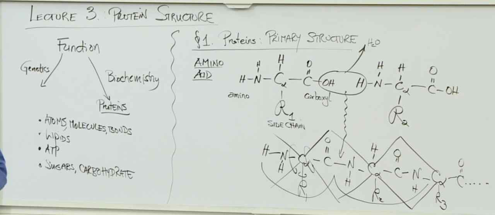
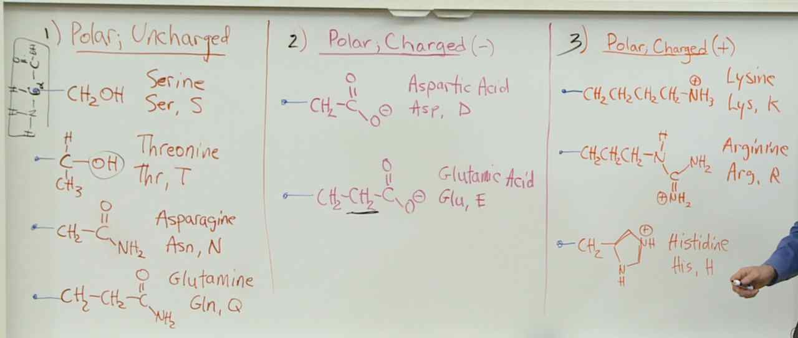
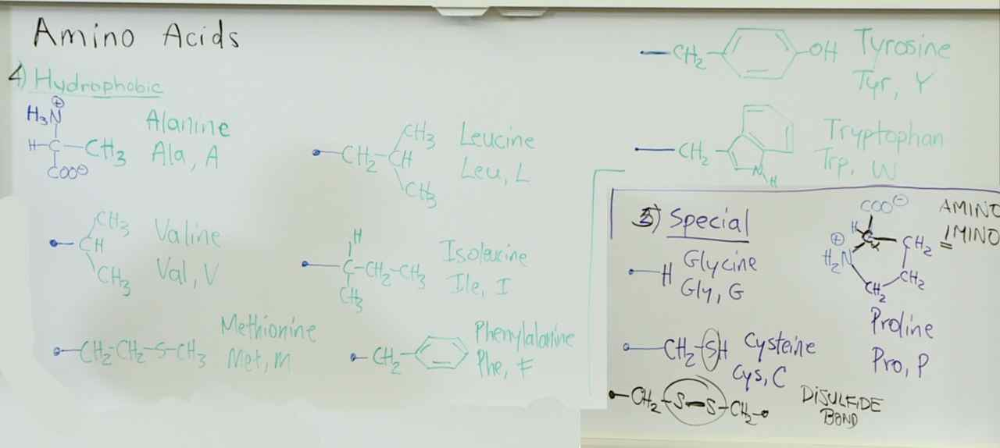
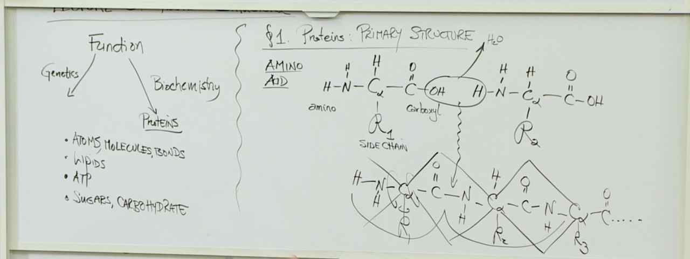
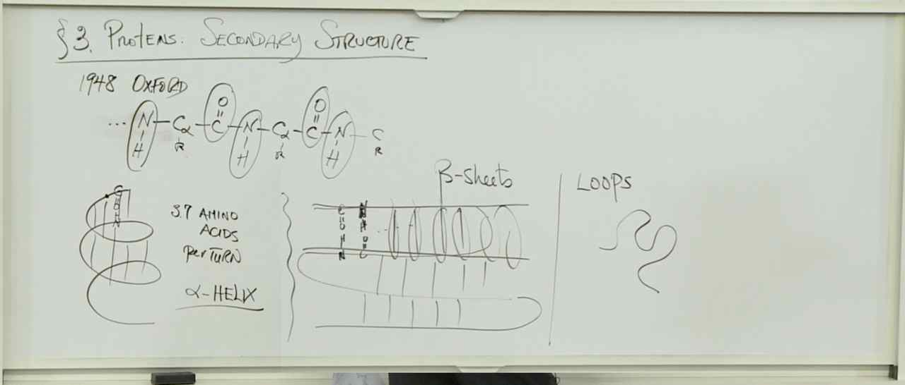
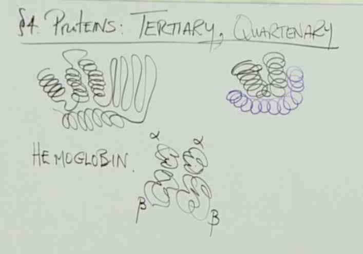

# Lecture 3: Proteins

## Primary Structure
Building block: Amino Acid

20 Acids:
- 4 Polar Uncharged (S T N Q)
- 2 Polar Negative (D E)
- 3 Polar Positive (M R H)
- 8 Non polar (A V M L I F Y W )
- 3 Special (G C P)

> Side chains of polar, uncharged amino acids have polar covalent bonds, side chains of non-polar amino acids do not.
> Although both Cys and Met have sulfur in their side chains, only Cys can form disulfide bonds because only Cys has a -SH (sulfhydryl) group.

## Proteins Secondary Structure
> The secondary structure of a protein is a local region of alpha helix or beta sheet that is stabilized by Hydrogen bonds between N-H and C=O of the polypeptide backbone.

## Proteins Tertiary, Quaternary Structure
- Ter: Entire structure of the thing
- Qua: Multiple Ters bonding
	- Hemoglobin ~= our blood
		- 2 globins: 2 ɑ, 2 β
		- lots of alpha-helixes
	- Proteins change shape when binding with a new oxygen
	- Porin
		- beta-sheets
		- turning into beta-barrel
	- TAL
		- double helix and TAL wraps around binding to a specific DNA

- The tertiary and quaternary structures of proteins are stabilized by
	- Disulfide bonds
	- Ionic bonds
	- Hydrogen bonds
	- Van der Waal forces

> Changing the order of the amino acids will certainly change the overall shape of the protein. In addition, the tertiary structure is disrupted through the breakage of non-covalent bonds. A small increase in temperature can add sufficient energy to disrupt weak forces like van der Waals and some hydrogen bonds, and this can change the overall shape of the protein. A large increase in temperature will cause the protein to denature. Similarly, a change in the pH causes the tertiary structure to destabilize by changing the electrostatic interactions between charged amino acids. Interaction of other molecules often alters the shape of a protein.

