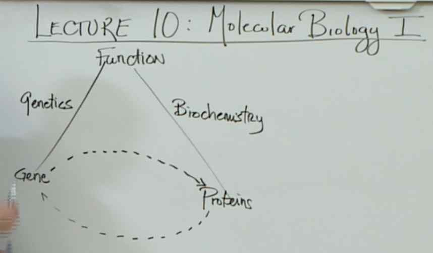
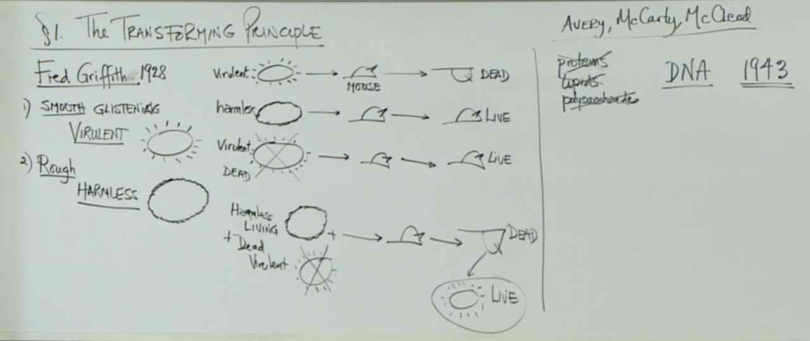
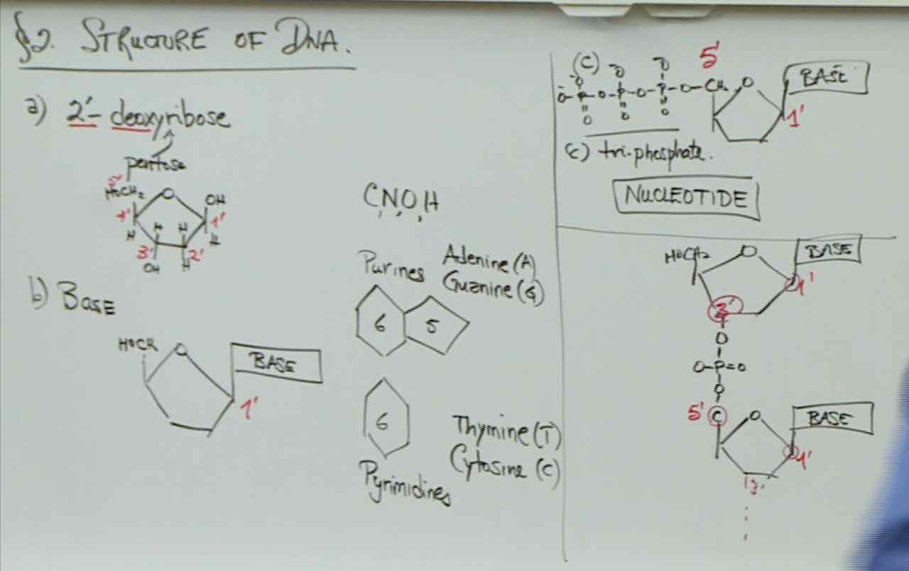
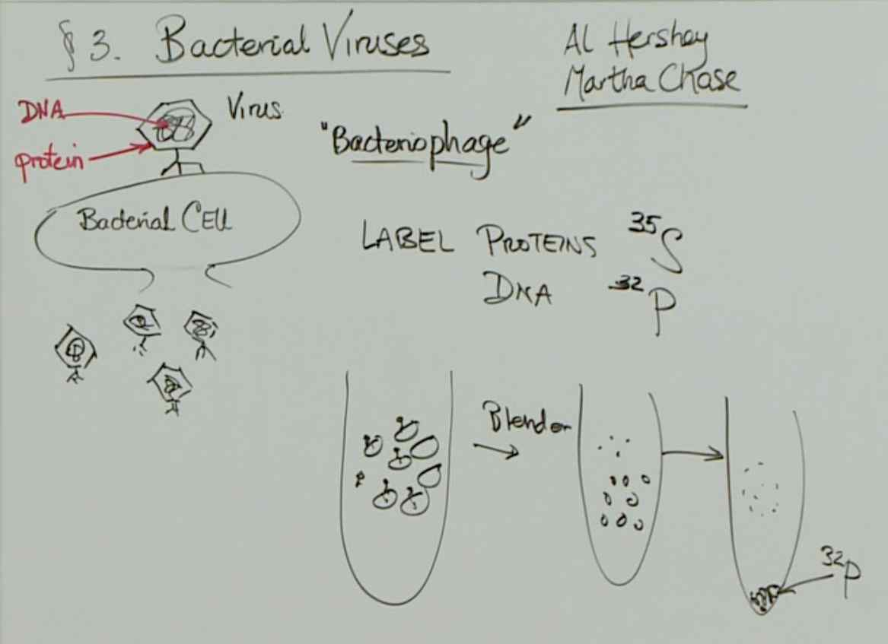
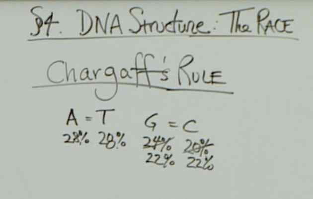
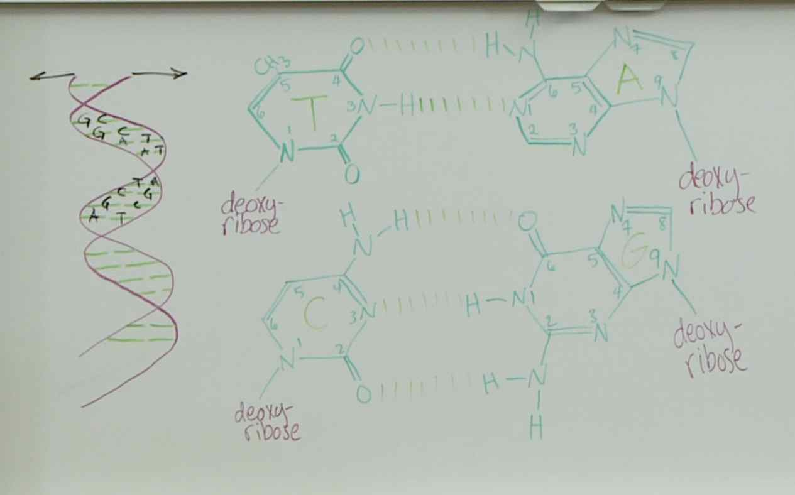

# Lecture 10 -- Molecular Biology I

> 

> 
> These unfortunate mice contracted pneumonia and died. The living, but harmless, rough bacteria acquired DNA from the heat-killed virulent bacteria, and transformed into smooth virulent bacteria that killed the mice.

> 
> - 1 deoxyribose
> - 1 nitrogenous base (adenine, guanine, cytosine, thymine) attached to the 1’ carbon of the sugar
> - 1, 2, or 3 phosphate groups attached to the 5’ carbon of the sugar

> 
> The capsid is composed of protein that Hershey and Chase labeled with 35S. The amino acids cysteine and methionine include sulfur, while nucleic acids do not include any sulfur. The genetic material is composed of nucleic acid that Hershey and Chase labeled with 32P. Nucleic acids include phosphorus in the sugar-phosphate backbone, while proteins do not include any phosphorus.

> 
> If the nucleic acid is double-stranded DNA, then the percentage of guanine in the sequence equals the percentage of cytosine, and the percentage of adenine equals the percentage of thymine due to base pairing. In other words, the number of guanines equals the number of cytosines, and the number of adenines equals the number of thymines by sequence. Therefore, the DNA includes 12% guanine and 12% cytosine. 100% minus 24% (12%+ 12%) equals 76%, the total percentage of adenine and thymine. 76% divided by two equals 38%. So the percentage of adenine equals 38%.

> 
