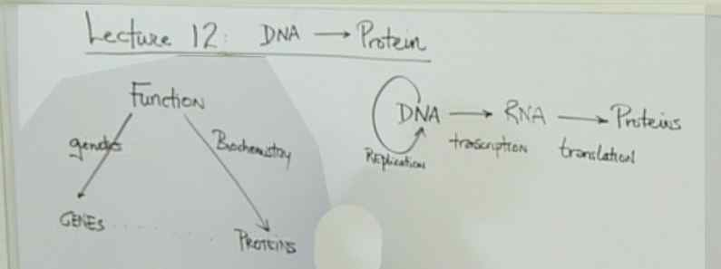
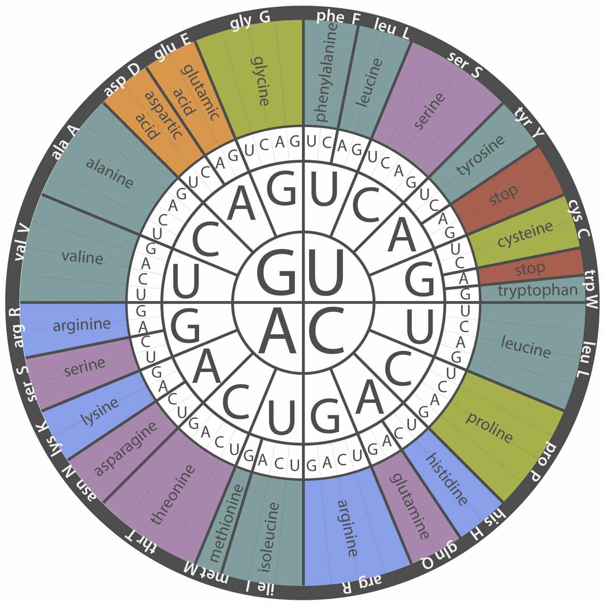

# Lecture 12 -- DNA --> Protein

> 

> 
> Both deoxyribonucleotides (dNTPs) and ribonucleotides (NTPs) have an OH group on the 3’ carbon of the sugar. This OH group is required for extension during DNA replication or RNA synthesis. Deoxyribonucleotides lack the OH group on the 2’ carbon of the sugar as indicated by the name 2’-deoxyribose. The nitrogenous bases are attached to the deoxyribonucleotides and ribonucleotides at the 1’ carbon of the sugar.

> 
> RNA polymerase reads a DNA template in the 3’ to 5’ direction to synthesize RNA in the 5’ to 3’ direction. Transcription can occur in either direction, but not in either direction from a single promoter. RNA polymerase can only transcribe in one direction (5’ to 3’) with respect to reading one strand of the template DNA in the opposite direction (3’ to 5’). In general, each promoter recruits RNA polymerase to a particular site and indicates in which the direction RNA polymerase will move along the DNA. As RNA polymerase is moving, there will be only a single strand that can be used as a template to allow 5' to 3' synthesis of a transcript.
> For RNA polymerase to synthesize RNA in the 5’ to 3’ direction going from left to right, RNA polymerase reads the bottom strand in the 3’ to 5’ direction. For RNA polymerase to synthesize RNA in the 5’ to 3’ direction going from right to left, RNA polymerase reads the top strand in the 3’ to 5’ direction. Note that you may see the template strand referred to as the non-coding strand or antisense strand in other courses or books.

> 
> 
> mRNA = 5' AUAGAUGAAGCCCCACGCCUAGGAG 3' -> Met-Lys-Pro-His-Ala
> The ribosome reads the mRNA in the 5’ to 3’ direction to translate a polypeptide chain of amino acids from the N- to C-terminus. The ribosome starts translation at the first AUG. You see the first AUG or first codon at the fifth base listed here. Use this AUG to set the frame for the rest of the polypeptide chain. The sixth codon is 5’-UAG-3’, which is a stop codon. So translation stops, and no amino acid is added at the sixth position.

> 
> The universality of the genetic code implies that all living organisms have a common ancestor.
