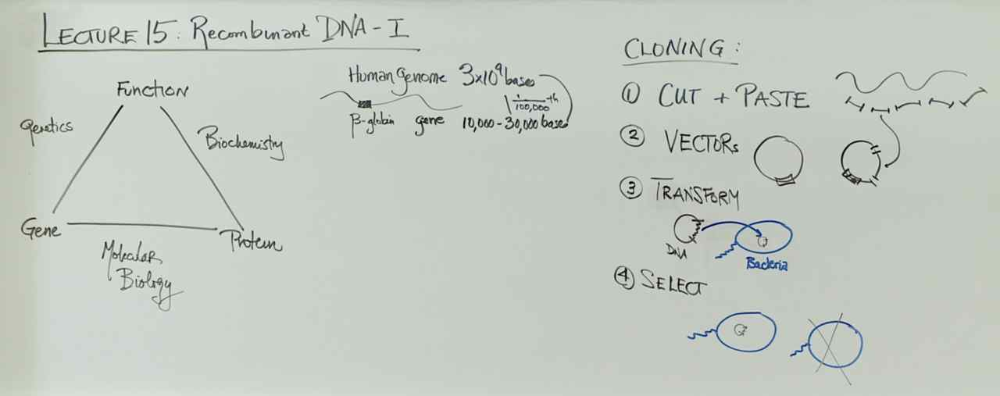
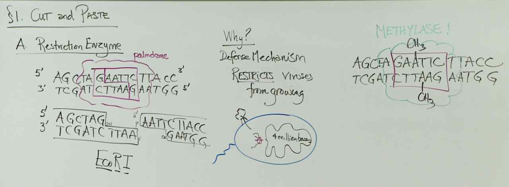
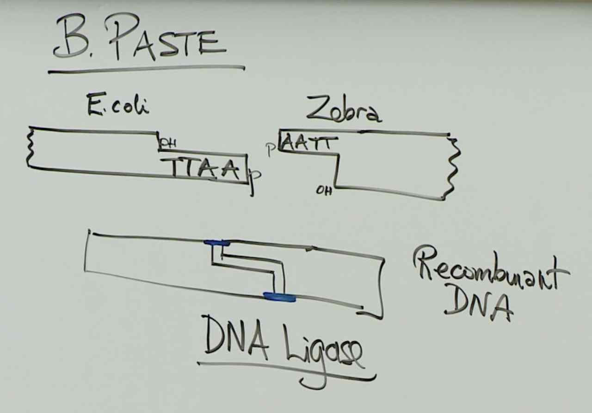
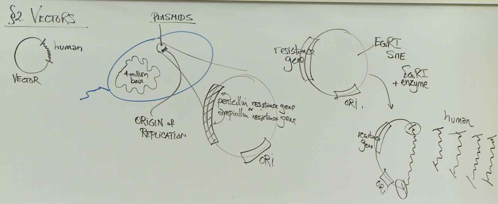
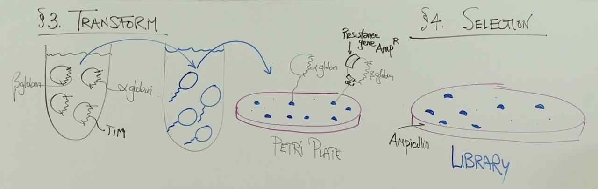

# Lecture 15 - Cloning: Prurifying a Gene

> 
> Why is biochemical purification of one gene away from the other genes in a cell more challenging than biochemical purification of one protein away from the other proteins in a cell?
> As discussed in Week 2, proteins are purified based on size, charge, or even a specific function. All genes consist of deoxynucleotides with the bases adenine, thymine, guanine, and cytosine. You cannot distinguish one gene from another in a purification scheme based on chemical structure.

> 
> - Each restriction endonuclease recognizes a specific sequence of double-stranded DNA. This recognition sequence differs from one restriction endonuclease to the next. The enzyme breaks the bonds between adjacent nucleotides on both strands of the double-stranded DNA. This cut can be directly aligned on both strands to create blunt ends or staggered to create single-stranded overhangs or “sticky ends”.
> - DNA ligase binds to DNA to form phosphodiester bonds between nucleotides. DNA ligase functions during replication to seal gaps between the Okazaki fragments. DNA ligase can be used to seal together fragments of DNA during cloning in a test tube. Peptide bonds are found between amino acids in a polypeptide.

> 
> DNA ligase binds to DNA to form phosphodiester bonds between nucleotides. DNA ligase functions during replication to seal gaps between the Okazaki fragments. DNA ligase can be used to seal together fragments of DNA during cloning in a test tube. Peptide bonds are found between amino acids in a polypeptide.
> - Restriction enzyme site: Allows the circular, double-stranded vector to be cut so that an exogenous piece of double-stranded DNA can be ligated into the vector (plasmid).
> - Origin of replication: The host cell replication machinery will recognize the vector (plasmid) for replication by the origin sequence so that the vector (plasmid) can be replicated to pass a copy of the vector (plasmid) to each daughter cell.
> - An antibiotic resistance marker is a gene that produces a protein that provides cells expressing this protein with resistance to an antibiotic.

> 

> 
> *One method for purifying a human gene away from the other genes in a cell is to: 1) cut the cells’ DNA with a restriction enzyme, 2) cut many copies of a vector that has the ampicillin resistance gene with the same restriction enzyme, 3) ligate each of the human DNA fragments into a cut vector, 4) add DNA ligase to form a bond between the human DNA fragments and the vectors, 5) transform the pool of recombinant vectors (vectors that contain a human DNA fragment) into bacterial cells, and 6) select cells that have acquired a plasmid. The bacteria that you will transform in step 5 would be __________________ prior to transformation. The type of medium that you would use for step 6 would be _________________.*
> You want the bacterial cells to be ampicillin sensitive so that you can select for cells that take in the plasmid with the ampicillin resistance gene after transformation. Sensitive means that the bacterial cells cannot grow and divide or die in the presence of a drug before transformation when the plasmid or vector containing the resistance gene enters the cells. Resistant means that bacterial cells do grow and divide in the presence of a drug. You want the selection medium to be minimal medium plus ampicillin or rich medium plus ampicillin. Any cells that do not contain the plasmid will not grow and divide on that medium. You do not want to use rich medium or minimal medium without ampicillin because all cells will grow and divide in the absence of ampicillin including the cells that do not contain the plasmid or vector of interest.
