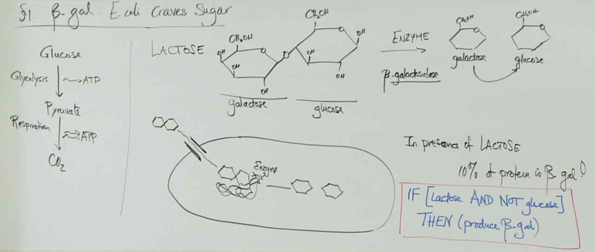
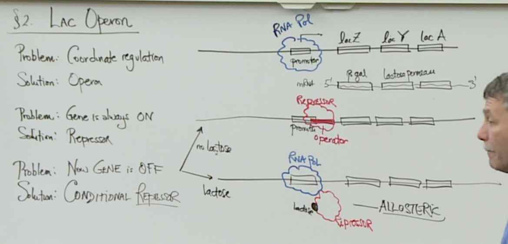
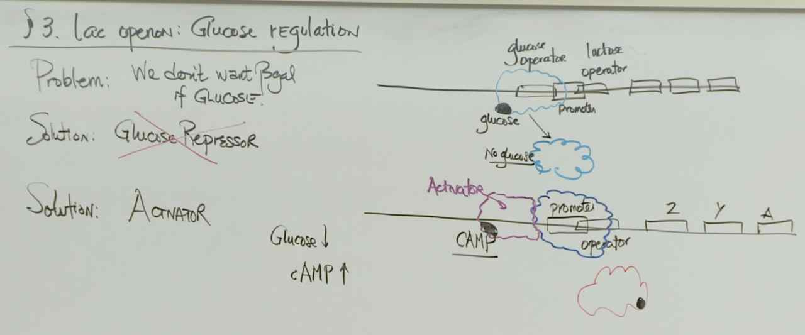
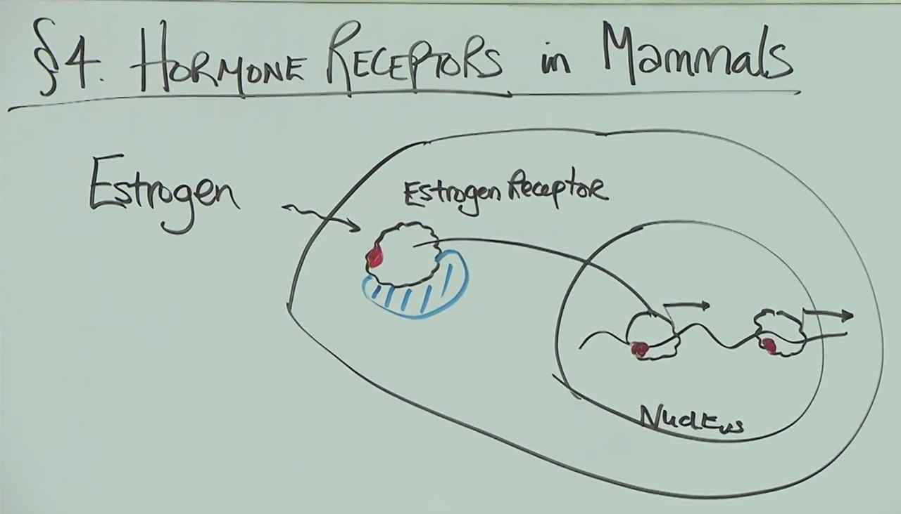
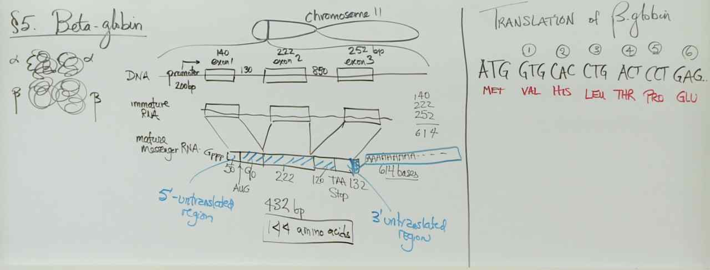
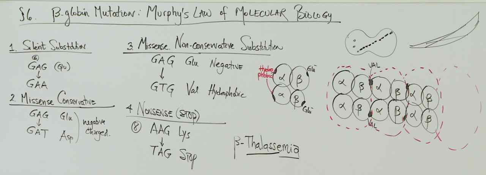
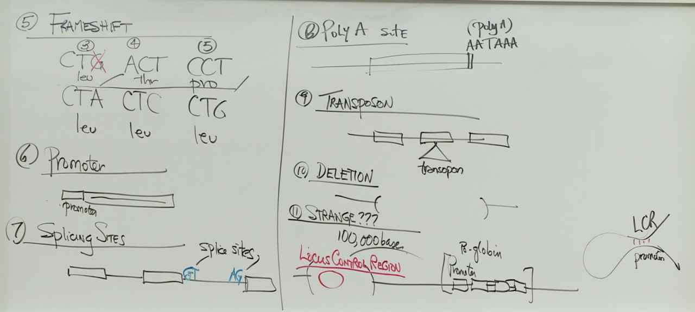

# Lecture 14 -- A Tale of Two Genes

> 
> Glucose is the preferred sugar source for E. coli bacterial cells. In the absence of glucose and presence of lactose, bacterial cells can obtain more glucose by breaking down lactose into glucose and galactose. If glucose is present, the bacterial cells do not need to produce β-galactosidase.

> 
> The lac repressor binds to the lac operator of the lac operon. In the presence of lactose, lactose (allolactose) binds to the lac repressor. The lac repressor does not bind the promoter for the lac repressor. There is no binding site for glucose on the lac repressor.

> 
> It is important to recognize that the promoter for the lac operon is a weak promoter and not very effective at recruiting RNA polymerase. When levels of glucose are low, there is a corresponding increase in cyclic AMP (cAMP). High levels of cAMP activate an accessory protein that can bind near the lac promoter and increase the binding of RNA polymerase to the lac promoter. The binding of the accessory protein, called an activator protein, increases transcription from the lac operon when levels of glucose are low.

> 
> - Estrogen must cross the phospholipid membrane.
> - Estrogen must bind to the estrogen receptor.
> - The binding of the estrogen and receptor complex to the estrogen responsive elements must alter the transcription of the target genes.
> The estrogen and receptor complex must translocate into the nucleus. The complex must bind DNA in the nucleus to affect transcription of target genes.

> 
> *The β-globin gene has three exons of 140, 222, and 252 nucleotides and two introns of 130 and 850 nucleotides. Given only this information, what is the longest polypeptide that the mature mRNA can encode?*
> The longest polypeptide would result from the translation of an mRNA that includes the three exons and no introns after splicing. The three exons together total 614 nucleotides (140 + 222 + 252). Assuming that the AUG starts at the first, second, or third nucleotide to start the frame of translation and that the stop codon is present at the end, the ribosome could translate a total of 204 codons (614/3). Because the last codon is a stop rather than coding for an amino acid, then the longest polypeptide is 203 amino acids long.

> 
> 
> The only mutation that guarantees that no functional β-globin protein is present is a mutation in the promoter that prevents transcription of the gene. Any other mutation could change the polypeptide produced, but that does not guarantee that the protein is not functional. Point mutations or frameshifts may have no effect on protein function. Although specific point mutations, frameshifts, and transposon insertions can cause the protein to be nonfunctional, not every point mutation, frameshift, or transposon insertion will be detrimental to the protein.

> 
> It is thought that unequal crossing over resulted in several duplications of the globin gene in a localized region of the chromosome. Over time, random mutations altered the DNA sequence of the duplicated regions with respect to the others. Some changes in the DNA sequences resulted in globin proteins that had slightly different functions. If the altered globin proteins conferred an advantage to the organisms, then those organisms reproduced and passed the chromosome with the duplicated regions on to their offspring.
