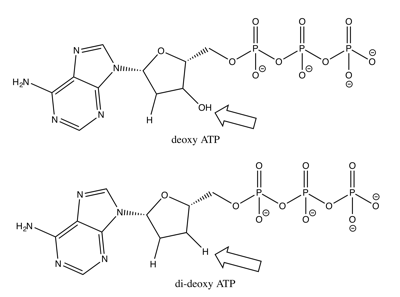
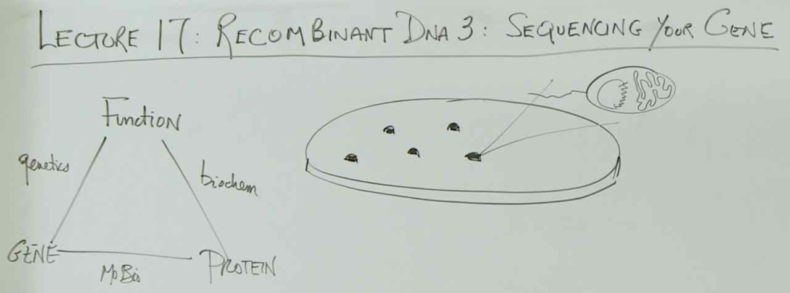
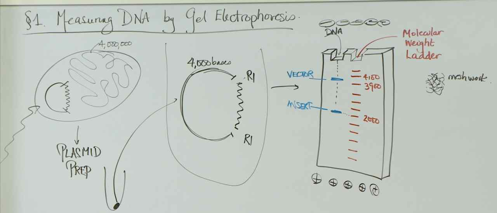
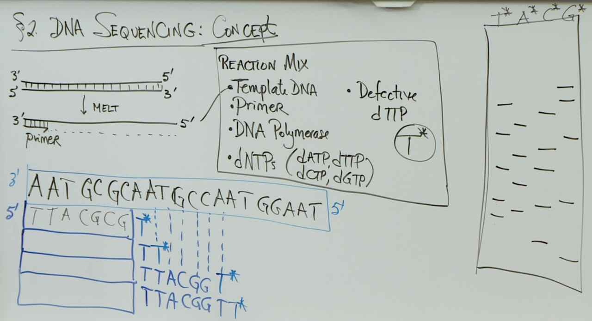
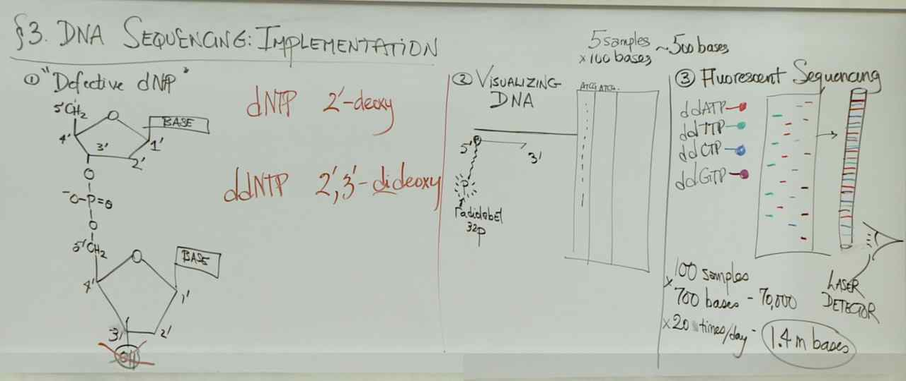
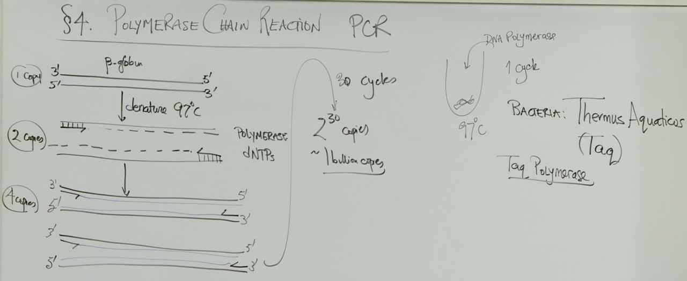
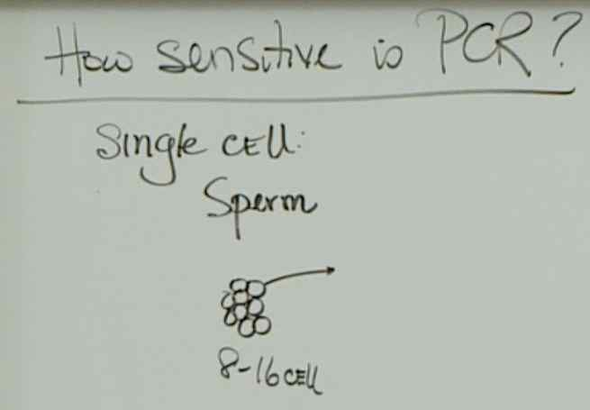

# Lecuture 17 - Analyzing a Gene

## Quizzes
> The DNA fragments separate by size. The DNA fragments move towards the positive electrode because of the negatively charged phosphate groups in DNA. The linear fragments have to move through the pores of an agarose gel, so smaller fragments of DNA move easier than larger DNA fragments.

> In a DNA sequencing reaction, you need template DNA, one DNA primer to provide the free 3′ OH for the start of DNA synthesis, DNA polymerase to synthesize the DNA, and all dNTPs. PCR, not DNA sequencing, requires forward and reverse primers.
> Defective nucleotides or dideoxynucleotides (ddATP, ddCTP, ddGTP, and ddTTP) are also needed.

> In dideoxy DNA sequencing, DNA polymerase synthesizes DNA using the 3'-OH on the primer and the complementary strand as the template. In this case, the primer will bind to the first 15 nucleotides of one strand of the double-stranded DNA. Given that DNA polymerase synthesizes at least one new nucleotide in each sequencing reaction, the 5' to 3' directionality must be set so that the primer's 3' end is at the junction of double-stranded and single-stranded template DNA rather than at the very end of the DNA. In dideoxy sequencing reactions, synthesis will stop whenever a dideoxynucleotide or ddNTP is incorporated. Summing the products in all four reactions, this should happen at every position possible until DNA polymerase reaches the end of the template DNA. So the first product is the primer+1 ddNTP (16 nucleotides long). The second product is the primer + 1 dNTP + 1 ddNTP (17 nucleotides long). There will be a total of 85 possible products of unique lengths.

> You want to make sure that you have one primer that is complementary to a sequence and binds to the left of the gene and one primer that is complementary to a sequence and binds to the right of the gene. You also need both primers to be in the 5′ to 3′ direction with the 3′ end being on the inside so that the P gene is amplified. That means that the each primer binds a different strand of the DNA. In pair 2, 5’ TCCGGC 3’ is complementary to and binds to the bottom strand of DNA on the left side of the P gene. 5’ GCCGGA 3’ is complementary to and binds to the top strand of the DNA on the right side of the P gene. Note: you do not have to have primers bind exactly to the start and end of the P gene to amplify the gene. You will amplify the gene (a small amount of extra sequence) if you have primers bind in the correct orientation upstream and downstream of the P gene. For more information on PCR, please see this video.

## Whiteboard

