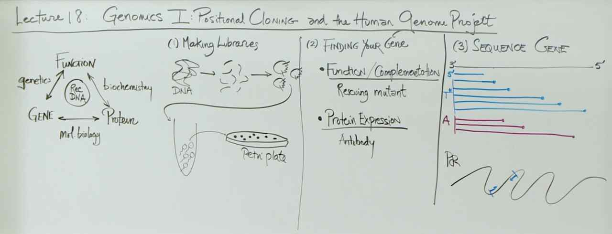
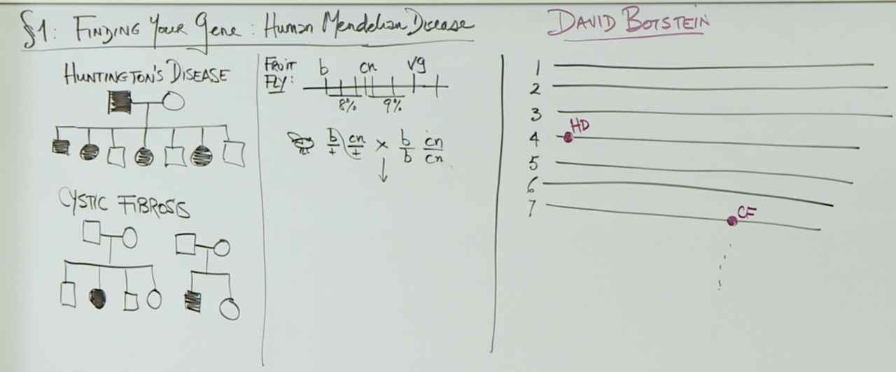
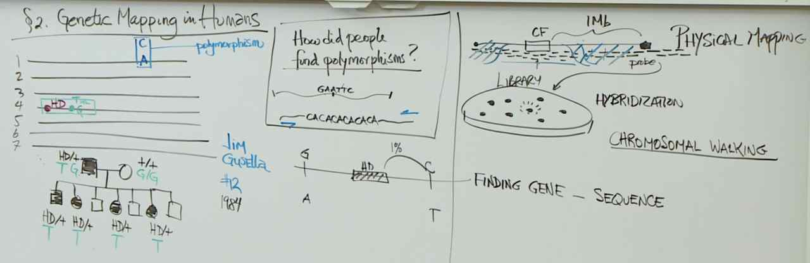
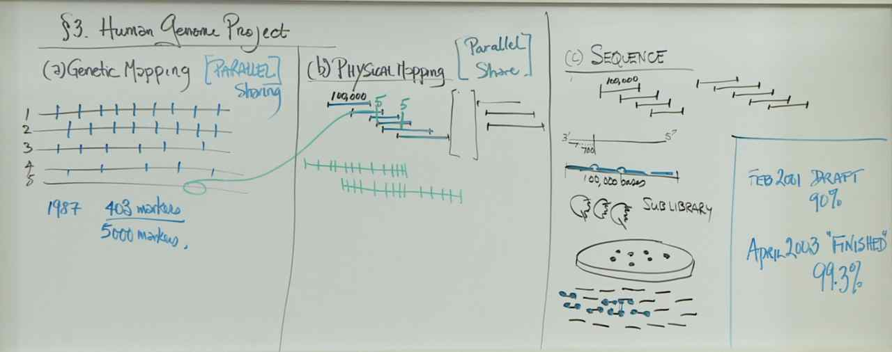
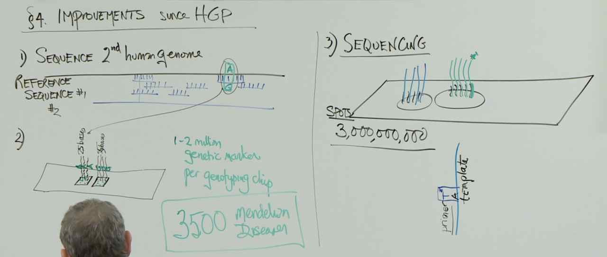

# Lecture 18 -- Human Genome Overview

> - A review of all of the recombinant DNA lectures.
> - An overview of how to find the gene associated with a human Mendelian disease.
> - An explanation on how to find markers across the genome for positional cloning.
> - A description of genome assembly and analysis through the Human Genome Project.
> - The details on technological improvements since the Human Genome Project.
> - A description of the improvements in DNA sequencing technologies.
> - A tour of the key features of the genome.
> - A description of evolutionary comparison.
> - An explanation of how to use evolutionary comparison as a tool for biomedical research.
> - An overview of using DNA polymorphisms within humans.

## Quiz
###Recombinant DNA

> Professor Lander outlined two different ways to find a gene of interest in a library (the collection of colonies formed from cells that each carry a different recombinant vector). In method 1, mutant cells are transformed with recombinant library vectors, and cells that no longer showed the mutant phenotype contained a recombinant vector that carries the gene of interest. In method 2, the library is screened using an antibody that binds to the protein encoded by the gene of interest. For each question below, check the best answer.
> i) Which of these methods could be used if you had no information about the sequence of your gene of interest or the identity of the protein of interest encoded by that gene? Assume that you do have a mutant phenotype. Select the single best answer.
> ii) Which of these methods require that the host cells can transcribe the gene of interest? Select the single best answer.
> iii) Which of these methods require that the host cells can produce the protein of interest? Select the single best answer.

> i) Without knowing the sequence of the gene or what protein the gene encodes, you can use method 1 to find the gene of interest by complementation of a mutant phenotype. You can cut the genome to make inserts for the library without knowing sequence, and you test for protein function with the complementation. You have to know the protein and have protein available to make an antibody, so you cannot complete method 2. ii) and iii) In both methods 1 and 2, the cells must transcribe the gene of interest to produce a protein of interest. You need a functional protein to complement the phenotype in method 1, and you need the protein of interest present for antibody recognition in method 2.

### Finding Your Gene

> The concepts of genetic mapping first used by Sturtevant are applicable to mapping traits in humans. However, Professor Lander outlined problems that made such mapping in humans troublesome. Which of the following statements are problems for mapping like Sturtevant in humans?

> Mapping genes associated with traits using genetic crosses requires that there are many genes or markers spread across the genome. Even though you will certainly find a different gene or marker that is linked to the gene for the trait you are studying, there were very few known markers in the human genome.
> Mapping genes associated with traits using genetic crosses requires that the experimenter can arrange specific crosses (matings). This is very difficult to do with humans!
> Mapping genes associated with traits using genetic crosses also requires many offspring. Human families do not generate sufficient offspring.

### Genetic Mapping in Humans

> A single nucleotide polymorphisms (SNPs) is a single change of a nucleotide in the DNA sequence. A SNP can be inherited with a disease in the same pattern but does not have to be located within the gene or be the cause of the disease. In most cases, the associated SNP does not cause disease. SNP patterns can differ between siblings. If a SNP is rare, it is likely inherited.

### Improvements since the Human Genome Project

> To determine the SNP profile of any individual today, the researcher would 1) obtain a DNA sample from the individual, 2) decide which SNPs she wanted to examine, 3) order PCR primers that would allow amplification of each of the three regions containing the chosen SNPS, 4) complete PCR to amplify each of the regions containing the chosen SNPs, and 5) sequence the DNA of each PCR fragment.

### Sequencing Lab 1

> Sanger sequencing takes advantage of dideoxynucleotides. The lack of the 3'-OH on a dideoxynucleotide compared to a deoxynucleotide prevents DNA polymerase from…
> extending the newly synthesized strand that has incorporated a dideoxynucleotide during a sequencing reaction that includes all of the normal reaction components.
> DNA polymerase can insert any one of the four dideoxynucleotides using the 3'-OH from the previous deoxynucleotide and the 5' triphosphate of the incoming dideoxynucleotide, but DNA polymerase cannot extend from any dideoxynucleotide triphosphate due to the lack of the 3'-OH.

> You have the following sequence: 5'-ATATGCCGAGCAGTCATGGGCAATGGCA-3'
> Select the primer that allows for sequencing this fragment of DNA.
> 5'-TGCCAT-3'
> Primers must be complementary and anti-parallel to the template DNA. The 5'-TGCCAT-3' primer is complementary to the 3' end of the fragment, and it can be extended in the 5' to 3' direction to sequence the remaining nucleotides. The 5'-ATATGC-3' and 5'-ATGGCA-3' primers are identical, not complementary, to the template DNA fragment. The 5'-TATACG-3' primer has the complementary bases to the 5' end of the fragment, but the 5' and 3' labels are not correct for complementarity.

## Whiteboard

