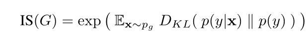
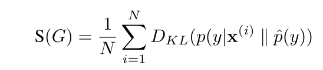
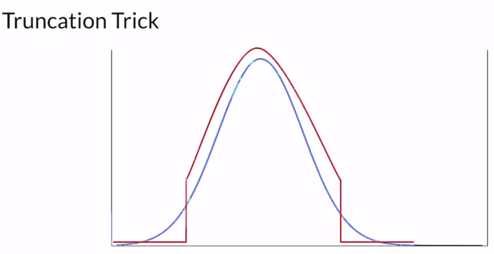
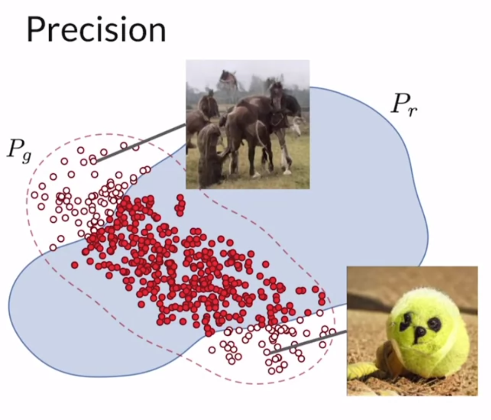
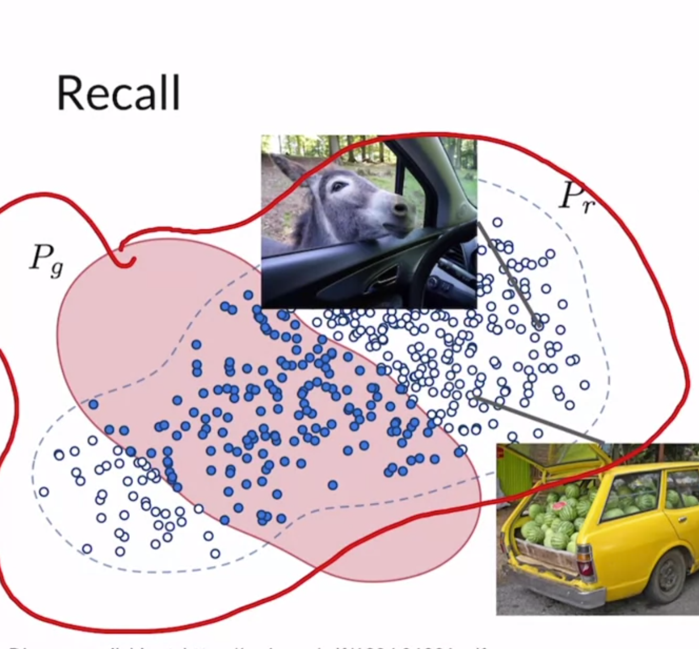

# Lecture Notes

## 1 - Thu Oct 29 (Evaluation of GANs)

- Challenge: A discriminator cannot be used for evaluation because it overfits to the generator it's trained with.
	- Two important properties
		- Diversity: variety of images
		- Fidelity: quality or realism of the image
- Pixel Distance
	- Bad!
	- Example: swap to two rows, small difference but huge pixel distance
- Feature Distance
	- Sum feature differences
	- Example: 1 feet, 1 nose vs 5 feet, 3 eyes
- Feature Extraction
	> 
	- Use pretrained classifier (ex. on ImageNet)
	- Not last / fully connected layer but feature layer (last pooling layer)
	- Use earlier layer if you need lower-level features (or if NN was trained on too small problem set)
	- Commonly used: Inception-v3
	- These Features are also called embeddings
	- Compare embeddings to compute Feature Distance
- Frechet Inception Distance -- $FID$
	- Calculates difference between reals and fakes
	- Use embeddings as two distributions and do statistics on those
	- Lower = Better
	- In `multivariate` distribution
	- Use large sample -> which makes it slow to run
- Inception Score ([Paper](https://arxiv.org/abs/1801.01973))
	> Original: 
	> Improved: 
	- Use classification (last layer)
	- KL Divergence
	- $1 \leq IS(G) \leq 1000$
		- $1000 = #classes$
		- Higher = Better
	- Can be exploited
		- generate only one of each class
		- highly overfitting
	- Only looks at fakes not reals
	- Slightly different trained NN can lead to drastic metric changes, even if accuracy is equal (Keras vs Torch Inception3)
	- Can miss important features
		- ImageNet isn't everything
	- Mostly replaced by FID
- Sampling and Truncating
	- Sampling $z$ at $0$ leads to great fidelity but poor diversity
	> 
	> It truncates the normal distribution that you sample your noise vector from based on a hyperparameter that determines how much of the tails to cut off or keep.
	> If you want higher fidelity, you want to sample around 0 and truncate a larger part of the tails. If you want greater diversity, then you want to sample more from the tails of the distribution and have a lower truncation value.
	- can lead to worse FID
	- HYPE (Human eYe Perceptual Evaluation) [(Paper)](https://arxiv.org/abs/1904.01121)
- Recall & Precision [(Paper)](https://arxiv.org/abs/1904.06991)
	> $g=fake, r=real$
	> 
	> $$p = \frac{overlap}{all fakes}$$
	> 
	> $$r = \frac{overlap}{all reals}$$
	- G tends to cover all **and more**
		- good recall, bad precision
		- thus truncate to improve precision
- Other
	- [FID Implementation Guide](https://machinelearningmastery.com/how-to-implement-the-frechet-inception-distance-fid-from-scratch/)
	- [FID in PyTorch (GitHub)](https://github.com/bioinf-jku/TTUR)

