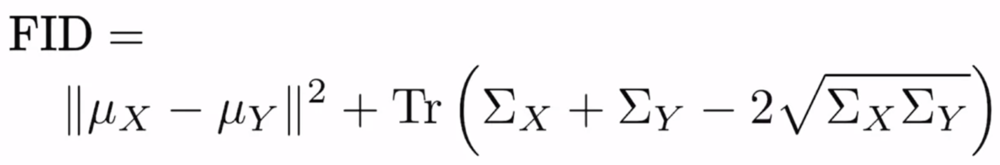

# Lecture Notes

## 1 - Thu Oct 29 (Evaluation of GANs)

- Challenge: A discriminator cannot be used for evaluation because it overfits to the generator it's trained with.
- Two important properties
  - Diversity: variety of images
  - Fidelity: quality or realism of the image
- Pixel Distance
  - Bad!
  - Example: swap to two rows, small difference but huge pixel distance
- Feature Distance
  - Sum feature differences
  - Example: 1 feet, 1 nose vs 5 feet, 3 eyes
- Feature Extraction
  - Use pretrained classifier (ex. on ImageNet)
  - Not last / fully connected layer but feature layer (last pooling layer)
  - Use earlier layer if you need lower-level features (or if NN was trained on too small problem set)
  - Commenly used: Inception-v3
  - These Features are also called embeddings
  - Compare embeddings to compute Feature Distance
- Frechet Inception Distance (FID)
 

