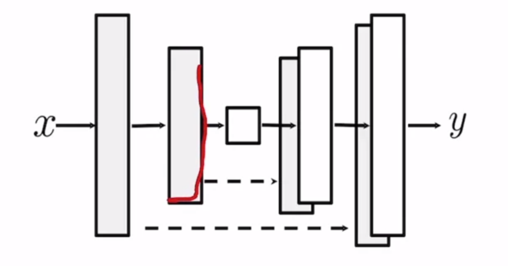
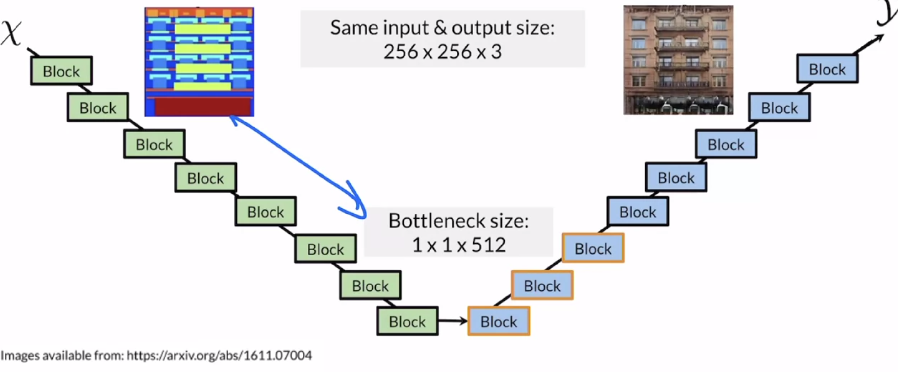
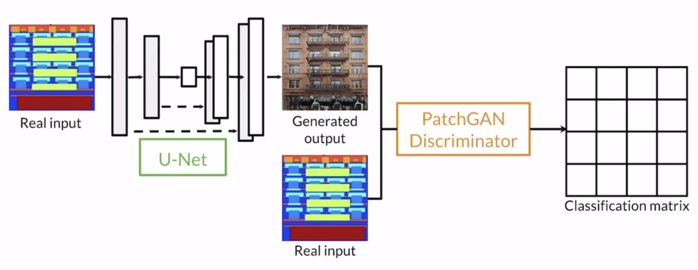
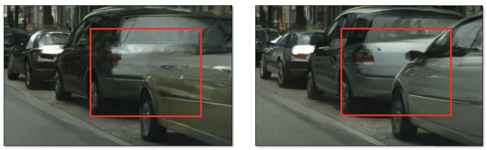
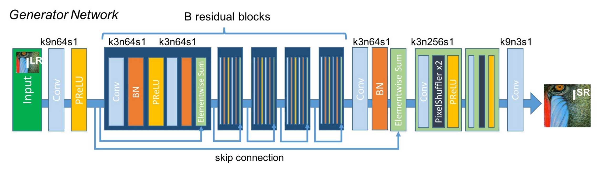
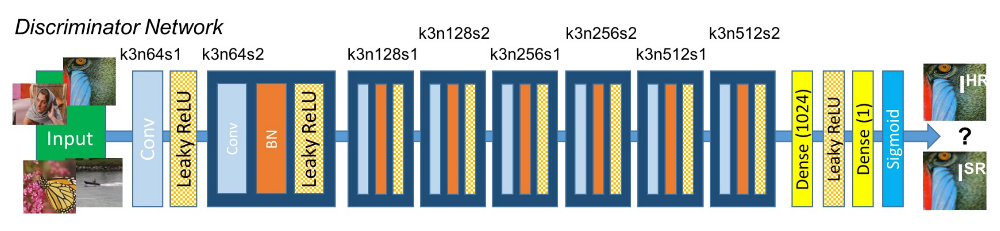

# Fri Jan 8 - GANs for Data Augmentation and Privacy

- Overview of GAN Applications
	- image translation generalizes to many tasks
	- many immediate application areas, including data augmentation
	- other fields use adversarial techniques for realism and robustness
- Data Augmentation: Methods and Uses
	- generate fake data when real data is too scarce
	- generate to anonymize private data (medical data)
- [RandAugment Paper](https://arxiv.org/abs/1909.13719)
	- Practical automated data augmentation with a reduced search space
- Pros
	- better than handcrafted examples
	- generate more labeled examples
	- improve downstream model generalization
- Cons
	- diversity is limited to the data available
	- not useful when overfit to real data
- GANs for privacy
	- encourage data-sharing between institutions
	- preserves privacy
	- Caveat: generated data may mimic the reals too closely
		- post-processing may help avoid this data leakage
		- but not only very close samples, thus it might not be possible for a third party to distingish between real/fake
- GANs for Anonymity
	- Pro: provide safe environment for expression to (stigmatized groups, assault victims, witnesses, activists)
	- Con: deepfakes; i.e. put words into people's mouths
- Generative Teaching Networks (GTN)
	- [Relevant Paper](https://arxiv.org/abs/1912.07768)
	- [Notebook](https://colab.research.google.com/github/https-deeplearning-ai/GANs-Public/blob/master/C3W1_Generative_Teaching_Networks_(Optional).ipynb)
	- > ... generator (i.e. teacher), which produces synthetic data, and a student, which is trained on this data for some task. The key difference between GTNs and GANs is that GTN models work cooperatively (as opposed to adversarially).
	- 
	- > We found that to achieve the same predictive power (rank correlation) as achieved with only 128 SGD steps on GTN-generated data, you would instead need 1200 SGD steps on real data.

## Links
- [Code - Albumentations - classic augmentation libary](https://github.com/albumentations-team/albumentations)
- [Code - imgaug - classic aug libary](https://github.com/aleju/imgaug)
- [Code - DAGAN](https://github.com/AntreasAntoniou/DAGAN)
- [Paper - Data augmentation using generative adversarial networks (CycleGAN) to improve generalizability in CT segmentation tasks](https://www.nature.com/articles/s41598-019-52737-x)
- [Paper - Few-Shot Adversarial Learning of Realistic Neural Talking Head Models](https://arxiv.org/abs/1905.08233)
- [Paper - De-identification without losing faces](https://arxiv.org/abs/1902.04202)
- [Paper - Attributing Fake Images to GANs: Learning and Analyzing GAN Fingerprints](https://arxiv.org/abs/1811.08180)

# Fri Jan 22 - Image-to-Image Translation with Pix2Pix
- Image-to-Image Translation
	- GANs' realistic generation abilities are well suited for this task
	- Paired translation means that you have input-output pairs that map exactly onto each other (1-to-1).
	- Can also include text2img or image2video
- Pix2Pix
	- Input image instead of classvector (and no more noisevector)
	- Upgrade Generator (UNet) and Discriminator (PatchGAN)
- Discriminator PatchGAN
	- Output: Matrix (70x70) of Classification-Values
	- BCE-Loss (0 fake, 1 real)
- Generator UNet (Image Segmentation)
	- Encoder-Decoder
		- Encoder
			- Input: 256x256x3
			- 8 Blocks
			- Conv (Stride=2) -> BatchNorm -> LeakyReLU
			- Output: 1x1x512
		- Decoder
			- Input: 1x1x512
			- 8 Blocks
				- first 3 Dropout to add noise
			- Trans Conv -> BatchNorm -> LeakyReLU
			- Output: 256x256x3
	- Skip-Connections
		- forward: add layers from early layers to later layers (concatenate)
		- backward: improve gradient flow (vanishing gradients)
	- 
	- 
- Pix2Pix Regularization Term
	- Pixel Distance
		- $\sum_{i=1}^n |\text{generated output} - \text{real output}|$
		- get close to real image
		- grants *supervision* (thus weight this term)
		- L1 Pixel Distance
	- Total Loss of Pix2Pix: $BCE + \lambda * Pixel Distance$
	- The real output image and the generated image should be encouraged to be similar
- Big picture
	-	
	- Discriminator loss
		- Real output (ones(70,70) vs result)
		- Fake output (zeros(70,70) vs result)
- Successors
	- high resolution (Pix2PixHD)
	- image editing (GauGAN)

## Links
- [Pix2Pix Code](https://github.com/phillipi/pix2pix)
- [Pix2Pix Paper](https://arxiv.org/abs/1611.07004)
- [Pix2PixHD Notebook](https://colab.research.google.com/github/https-deeplearning-ai/GANs-Public/blob/master/C3W2_Pix2PixHD_(Optional).ipynb)
	- global and local generators
	- multiscale discriminators
	- adds boundary maps to semantic maps
		- 
	- instance-level feature encoder to add noise
		- k-means for each pixel
		- select random class (eg. dirt, cobble) during inference
- [SuperResolution SRGAN Notebook](https://colab.research.google.com/github/https-deeplearning-ai/GANs-Public/blob/master/C3W2_SRGAN_(Optional).ipynb)
	- PReLU: $x_{\text{PReLU}} := \max(0, x) + a * \min(0, x).$
	-  
	- Generator: 
	- Discriminator: 
- [PatchGAN Paper](https://arxiv.org/abs/1803.07422)
- [GauGAN Notebook](https://colab.research.google.com/github/https-deeplearning-ai/GANs-Public/blob/master/C3W2_GauGAN_(Optional).ipynb)
