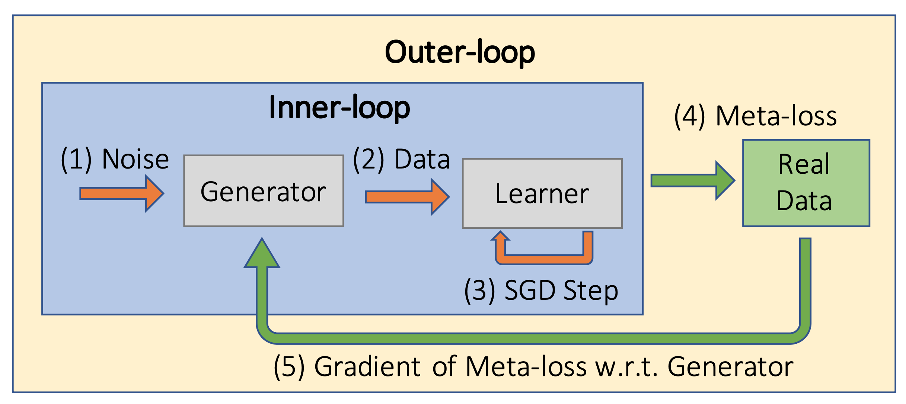

# Fri Jan  8 - GANs for Data Augmentation and Privacy

- Overview of GAN Applications
    - image translation generalizes to many tasks
    - many immediate application areas, including data augmentation
    - other fields use adversarial techniques for realism and robustness
- Data Augmentation: Methods and Uses
    - generate fake data when real data is too scarce
    - generate to anonymize private data (medical data)
- [RandAugment Paper](https://arxiv.org/abs/1909.13719)
    - Practical automated data augmentation with a reduced search space
- Pros
    - better than handcrafted examples
    - generate more labeled examples
    - improve downstream model generalization
- Cons
    - diversity is limited to the data available
    - not useful when overfit to real data
- GANs for privacy
    - encourage data-sharing between institutions
    - preserves privacy
    - Caveat: generated data may mimic the reals too closely
        - post-processing may help avoid this data leakage
        - but not only very close samples, thus it might not be possible for a third party to distingish between real/fake
- GANs for Anonymity
    - Pro: provide safe environment for expression to (stigmatized groups, assault victims, witnesses, activists)
    - Con: deepfakes; i.e. put words into people's mouths
- Generative Teaching Networks (GTN)
    - [Relevant Paper](https://arxiv.org/abs/1912.07768)
    - [Notebook](https://colab.research.google.com/github/https-deeplearning-ai/GANs-Public/blob/master/C3W1_Generative_Teaching_Networks_(Optional).ipynb)
    - > ... generator (i.e. teacher), which produces synthetic data, and a student, which is trained on this data for some task. The key difference between GTNs and GANs is that GTN models work cooperatively (as opposed to adversarially).
    - 
    - > We found that to achieve the same predictive power (rank correlation) as achieved with only 128 SGD steps on GTN-generated data, you would instead need 1200 SGD steps on real data.

## Links
- [Code - Albumentations - classic augmentation libary](https://github.com/albumentations-team/albumentations)
- [Code - imgaug - classic aug libary](https://github.com/aleju/imgaug)
- [Code - DAGAN](https://github.com/AntreasAntoniou/DAGAN)
- [Paper - Data augmentation using generative adversarial networks (CycleGAN) to improve generalizability in CT segmentation tasks](https://www.nature.com/articles/s41598-019-52737-x)
- [Paper - Few-Shot Adversarial Learning of Realistic Neural Talking Head Models](https://arxiv.org/abs/1905.08233)
- [Paper - De-identification without losing faces](https://arxiv.org/abs/1902.04202)
- [Paper - Attributing Fake Images to GANs: Learning and Analyzing GAN Fingerprints](https://arxiv.org/abs/1811.08180)
