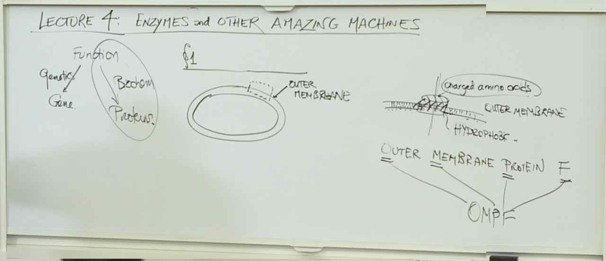
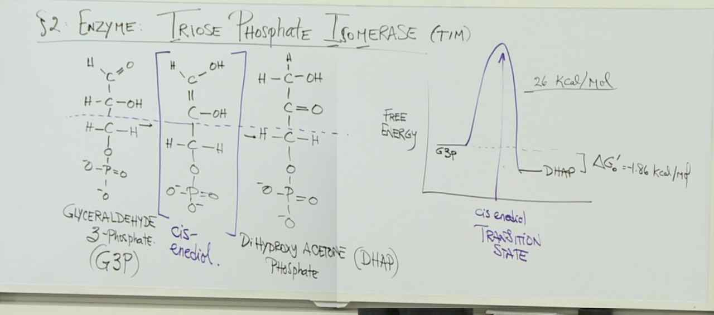
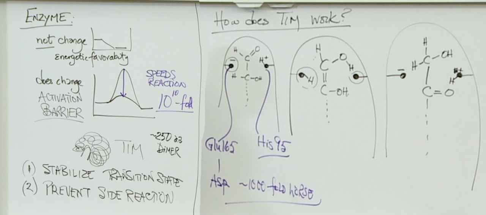
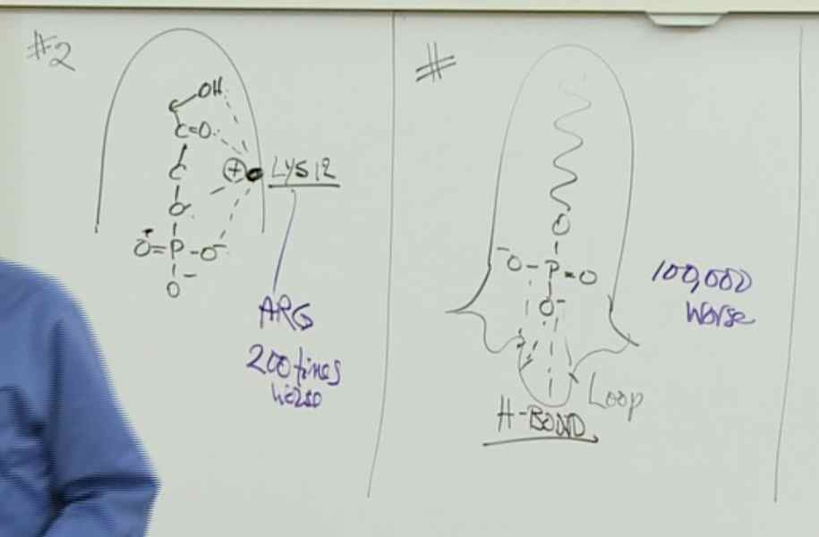
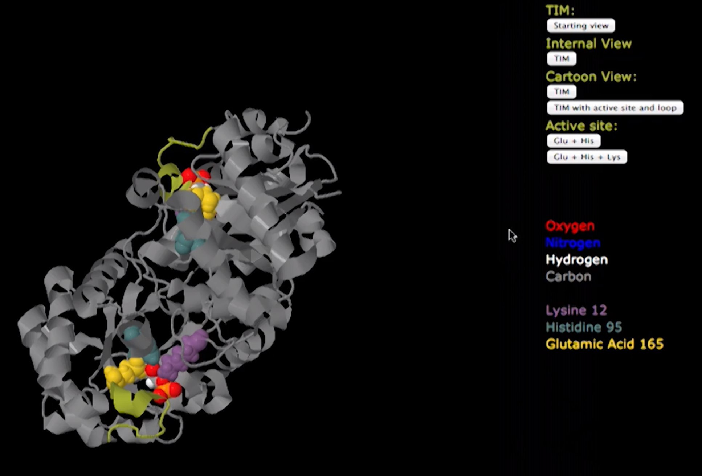
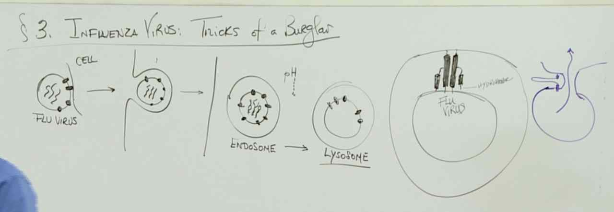
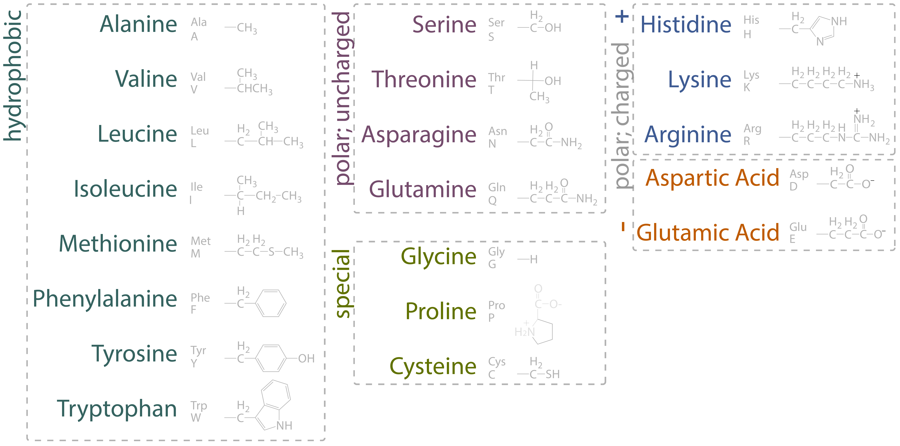

# Lecture 4: Enzymes and other amazing machines

## Design of a Membrane
- outer membrane, that let's in other molecules inside
	- 600 weight
	- no hydrophobic
	- no charged molecules

> barrels in membrane
> membrane: hydrophobic outside, hydrophilic inside
> thus barrel also non-polar (hydrophobic)
> barrel of size 600..
> positive and negative barrels (non-charged)

**OMPF** (Outer Membrane Protein)

## Enzymes: Triose Phosphate Isomerase (TIM)

- 2x Triose with Phosphate
- `G3P` less favorable compared to `DHAP` in terms of free energy
	- activation energy
	- transition state (cis-enodial) with high free energy of 26 kcal/mol (aka unfavourable)

> If the formation of product is energetically favored, then the product would be at a lower free energy than the reactant. Because the reaction requires an enzyme, you expect that there is an activation energy barrier associated with an intermediate molecule that is at a higher free energy state than either the products or the reactants.

### Enzyme
- not change energetic favorability
- does change activation barrier

TIM:
1. stabilize transition state
2. prevent side reaction
- speeds reaction time by $10^10$-fold
- about 250 amino acids big

> A catalytically perfect enzyme is one that catalyzes the reaction so efficiently that every time substrate binds to the enzyme, the reaction occurs. In other words, the rate of conversion is only limited by the diffusion of substrate.

> The positive charge of the Lysine at position 12 is important it the ability of TIM to bind to substrate. The substitution of arginine for lysine maintains this charge, and allows some substrate binding. The substitution of methionine for lysine prevents substrate binding.

## Influenza Virus: Tricks of a Burglar

> The primary sequence of amino acids remains the same in a viral protein. Changes in shape are due to changes in the secondary, tertiary, or quaternary structure of the viral protein. The temperature remains constant within a cell. The viruses change shape due to pH differences between different environments in the cell such as the neutral cytoplasm and acidic lysosome.

## ATTACKMENTS

