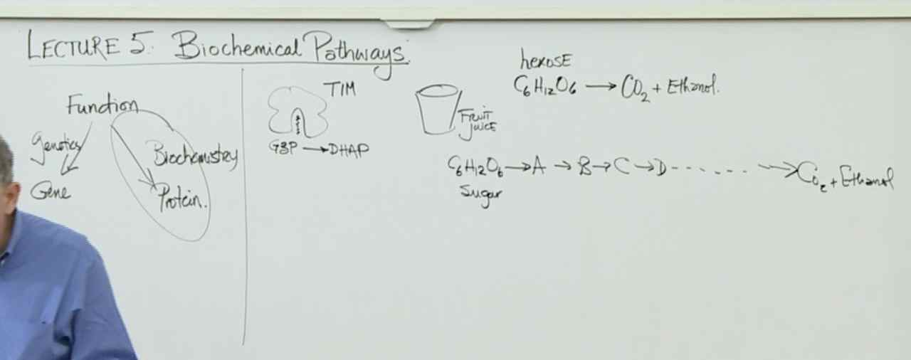
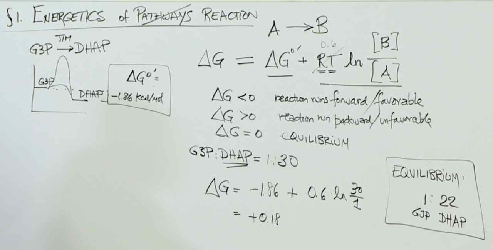
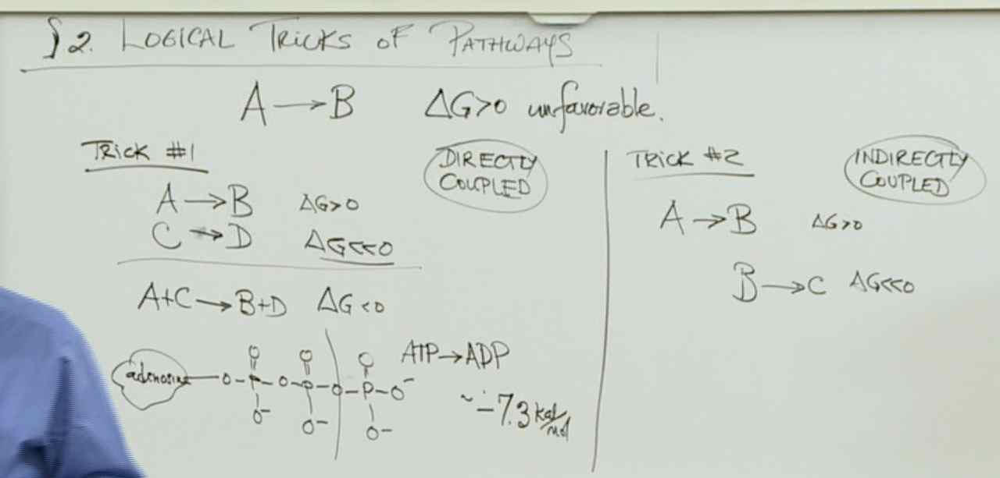
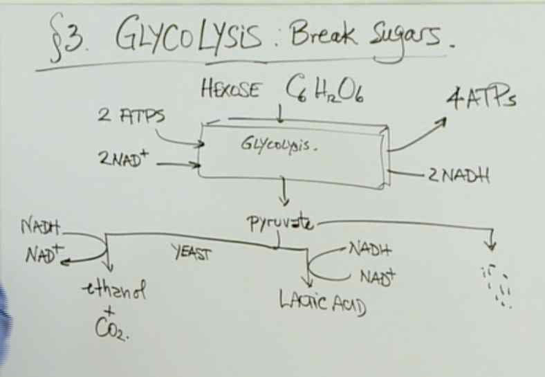
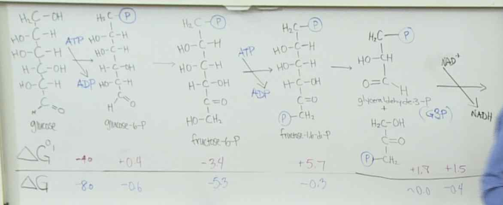
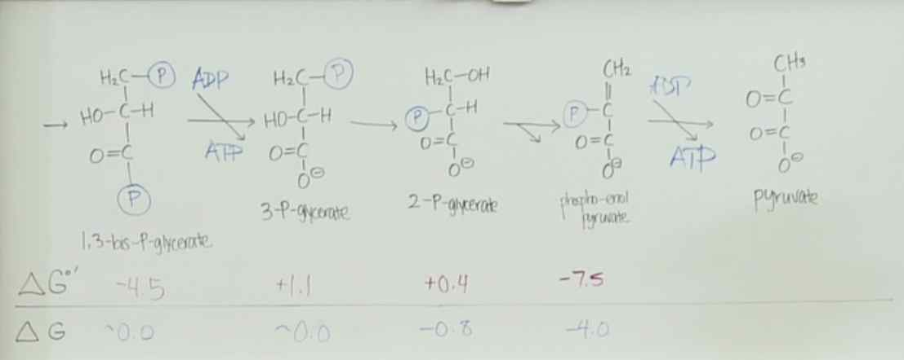
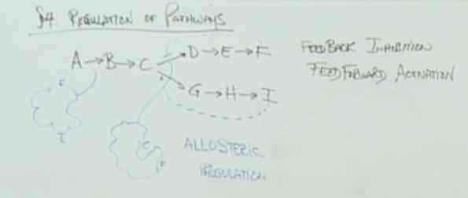

# Lecture 5 - Biochemical Pathways

## Energetics of ~Pathways~ Reaction
G3P -> DHAP ($\Delta G0'=-186 kcal/mol$)

- A -> B
	- $\Delta G = \Delta G^0' + RT ln \frac {B}{A}$
		- $RT = 0.6$
	- $\Delta G < 0$ reaction runs forwards / favorable
	- $\Delta G > 0$ reaction runs backwards / unfavorable
	- $\Delta G = 0$ Equilibrium

- $G3P:DHAP = 1:30$
	- $\Delta G = -186 + 0.6 ln \frac {30}{1} = +0.8 (>0)$
	- Equilibrium: $1:22$

## Logical Tricks of Pathways
A -> B ($\Delta G > 0$ unfavourable)

1. Trick: Directly Coupled
	- A -> B ($\Delta G > 0$ unfavourable)
	- C -> D ($\Delta G << 0$ favourable)
	- A+C -> B+D ($\Delta G < 0$ favourable)

	- ATP
		- `adenecine - triphosphate`
		- burn one: ATP -> ADP ~-7.3kcal/mol

2. Trick: Indirectly Coupled
	- A -> B ($\Delta G > 0$)
	- B -> C ($\Delta G << 0$)

> Enzymes cannot make an energetically unfavorable reaction favorable. Enzymes only increase the rate of a favorable reaction.

## Breaking of Sugar: Glycolysis
- Hexose $C_6 H_{12} O_6$
	- 2 ATPs, $2NAD^+$->  Glycolysis -> Pyruvate (Produces 4 ATPs, 2 NDAH)
		- Yeast -> Methanol + $CO_2$
		- Lactic Acid

> The more negative the  ΔG , the more thermodynamically favorable the reaction is to go forward. And as Professor Lander indicated, if we want to understand the thermodynamics of what is happening under cellular conditions, we need to use  ΔG , not  ΔG∘  (since the cell is not under "standard" conditions, it is under the particular biochemical conditions of the cell).

## Regulation of pathways
- A -> B -> C
	- D -> E -> F
	- G -> H -> I

- Allosteric Regulation (F binds to protein)
- Inhibition: Too much product? Don't make anymore!
	- Feed forward: enable
	- Feed backward: disable

> PEP is the product at the end of glycolysis. When PEP levels are high, it means that the cell does not need PEP production to increase. PEP can bind PFK to negatively regulate the activity of PFK at an earlier step in glycolysis to decrease the production of PEP. ADP is produced in the first half of glycolysis and used in the second half of glycolysis. When ADP levels are high, then the second half of glycolysis is not moving forward enough. ADP can bind PFK to positively regulate the activity of PFK to push the second half of glycolysis forward.

> Cellular respiration, the aerobic pathway, results in 36 ATPs. Fermentation, the anaerobic pathway, results in 2 ATPs.

> Lactic acid fermentation occurs in muscle tissues that are hard at work. Cellular respiration requires oxygen as an electron carrier. Muscles hard at work do not get supplied with enough oxygen to maintain cellular respiration and thus revert to the anaerobic process of fermentation.
