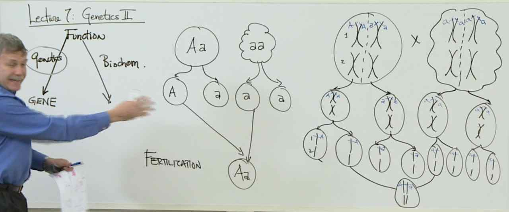
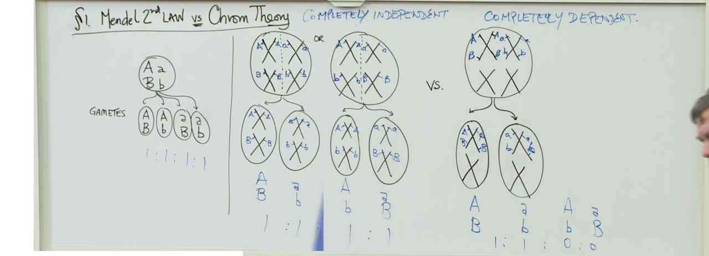
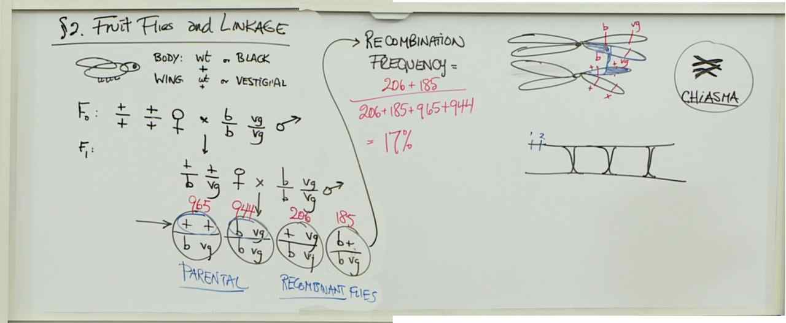
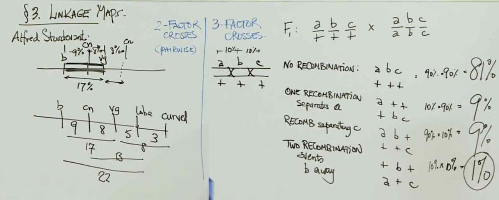
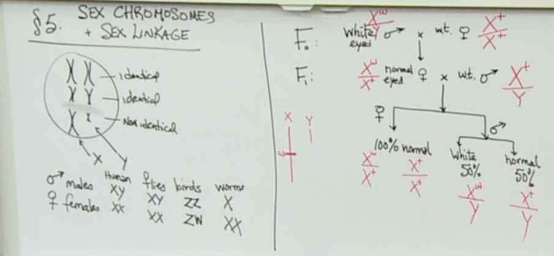

# Lecture 7 - Genetics II

# Genetics Test - Hints
## Simple Dominance
> One suggested strategy: Cross individuals with different traits (one male and one female) . Continue crossing individuals of different traits until you get a cage of individuals displaying only one trait. That is the dominant trait.

## Incomplete Dominance
> One suggested strategy: Cross individuals of the same trait until you are convinced you have a cage of homozygous individuals (this should only be possible for 2 of the traits). Crossing these homozygous individuals to homozygous individuals of another trait will reveal which two alleles combine to create the third trait (the heterozygote) demonstrating incomplete dominance.

## Sex Linkage I
> One suggested strategy: Establish homozygous populations by doing a series of crosses within a trait. Cross traits together, doing each sex pairing combination (male A x female B, female A x male B). In a non-sex-linked situation, this will look similar to problem 11, where one trait will present that is dominant over the other. If the traits are sex-linked, then the [male recessive trait] x [female dominant trait] cross will produce only dominant trait offspring, while both traits will appear in offspring of a [female recessive trait] x [male dominant trait] cross. The recessive trait offspring will all be male.

## Sex Linkage II
> One suggested strategy: Like in previous questions, establish homozygous populations by doing a series of crosses within a trait. Now cross traits together, paying attention to which sex carried which trait. In a non-sex-linked situation, this will look similar to problem 11, where one trait will present that is dominant over the other without respect to the sex of the parents. If the traits are sex-linked and the organism is XX female and XY male, then the [male recessive trait] x [female dominant trait] cross will produce only dominant trait offspring, while both traits will appear in offspring of a [female recessive trait] x [male dominant trait] cross. The recessive trait offspring will all be male. If the traits are sex-linked and the organism is ZW female and ZZ male, then the [female recessive trait] x [male dominant trait] cross will produce only dominant offspring, while both traits will appear in offspring of a [male recessive trait] x [female dominant trait] cross. The recessive offspring will all be female.

## Two Genes and Simple Dominance
> One suggested strategy: Your approach for this question will be very similar to question 11. Establish homozygous populations focusing on one gene at a time. The presence of a second gene makes no difference to our analysis. Cross traits of one gene, and the trait that the offspring display is the dominant one. Repeat this for the other gene.

## Two Genes and Linkage
> One suggested strategy: Establish homozygous populations and determine the dominance of individual traits as before. To determine the recombination frequency between the two genes associated with the linked traits, you need to produce an individual homozygous for both alleles associated with the recessive traits, and an individual heterozygous for the two genes (by crossing an individual homozygous for both alleles associated with the recessive traits with an individual homozygous for both alleles associated with the dominant traits). Once you have these, use Super Cross to cross them and examine a large number of offspring. Tally up the recombinant and parental offspring. The recombination frequency = [(# recombinant)/(total offspring)]*100.
