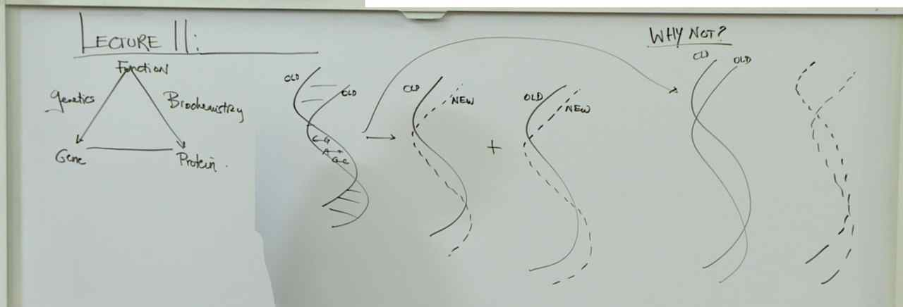
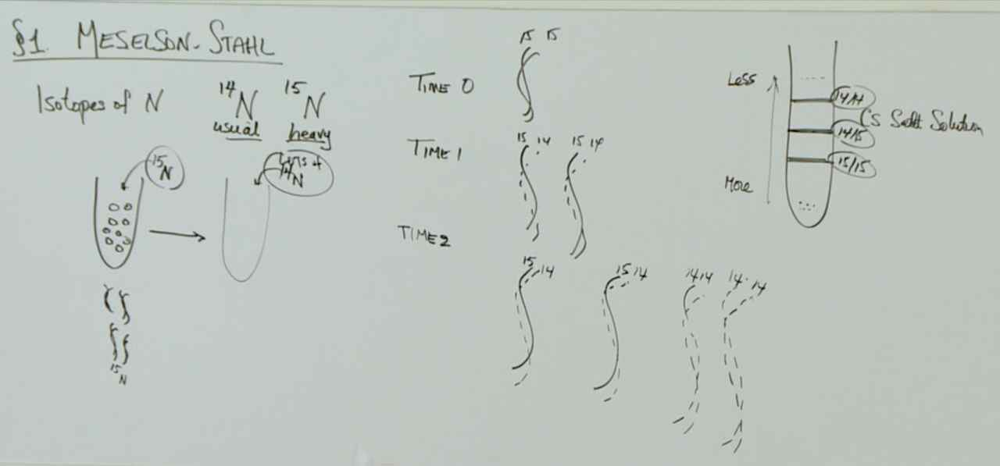
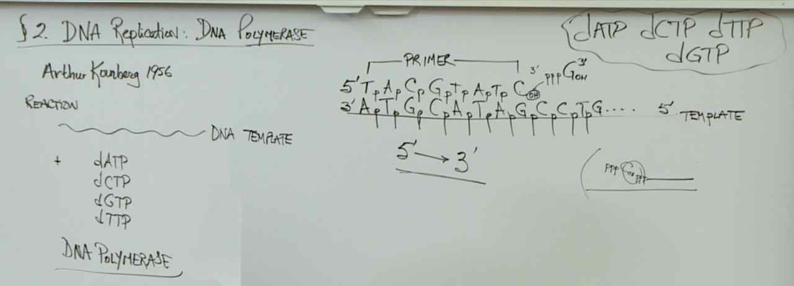
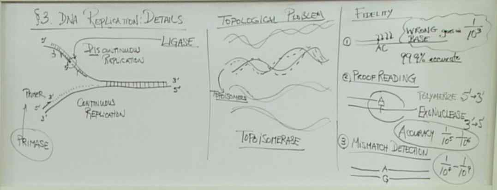
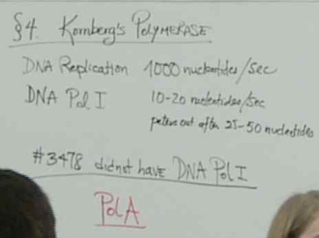

# Lecture 10 -- Molecular Biology I
> 

> 
> In the historical experiment, Meselson-Stahl first cultured bacterial E. coli cells to grow and divide in the presence of 15N. After many rounds of cell division, they transferred the cells to a medium containing 14N. After allowing the cells to grow and complete one round of replication and division, which one of the following choices best describes the properties of double-stranded DNA molecules in the population of cells?
> One type of double-stranded DNA molecule, all DNA molecules have incorporated both 14N and 15N.
> After growth and division in a medium containing 15N, the double-stranded DNA molecules have two strands containing 15N in the nitrogenous bases. After the cells are transferred to the 14N medium and allowed to complete one round of replication and division, the double-stranded DNA molecules are composed of the template strand that contains only 15N, and the newly synthesized strand that contains only 14N. This is because of the semi-conservative nature of DNA replication. Meselson and Stahl actually let the cells complete two rounds of division, which allowed them to observe double-stranded DNA molecules with one 15N strand and one 14N strand as well as double-stranded DNA molecules with two 14N strands. This helped exclude other models of DNA replication. Note that there is an animation in the molecular biology resource box on the Meselson-Stahl experiment.

> 
> DNA polymerase synthesizes the new strand in the 5’ to 3’ direction. The template DNA is read in the 3’ to 5’ direction.

> 
> - In cells, **primase** creates an RNA primer in the 5’ to 3’ direction. DNA polymerase adds new nucleotides onto this primer.
> - **Topoisomerase** alters the conformation of DNA. During DNA replication, the two strands of DNA become tightly wound around each other ahead of a replication fork, and this creates tension that would eventually halt DNA replication. Topoisomerase prevents this tension from occurring.
> - DNA **ligase** forms a phosphodiester bond between the 3’ OH and the 5’ phosphate of adjacent Okazaki fragments.

> DNA polymerase synthesizes new DNA using its polymerase activity in the 5’ to 3’ direction. DNA polymerase removes mismatches during DNA replication with its exonuclease activity. The exonuclease acts in the opposite direction from DNA synthesis in the 3’ to 5’ direction.

> 
> The underlying assumption was this: if the enzyme Kornberg identified was the only DNA polymerase in the cell, then a loss-of-function mutation in the gene for this enzyme would be fatal. Therefore, if the enzyme Kornberg identified was the only DNA polymerase, mutants in the gene encoding this enzyme should not exist. Cells were mutagenized and each cell was isolated and allowed to grow and divide. Proteins were isolated from each mutant and tested for the presence of Kornberg’s enzyme. After nearly 3500 mutants were screened, one was found that was missing Kornberg’s enzyme. This suggested that there was more than one DNA polymerase in the cell.
