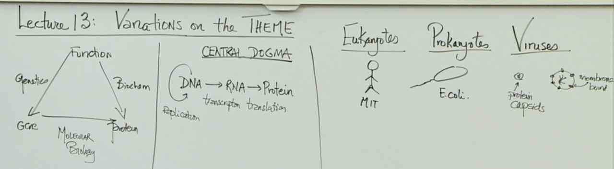
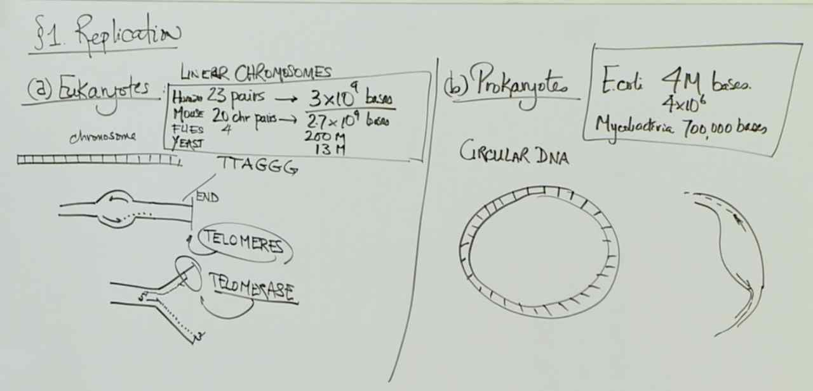
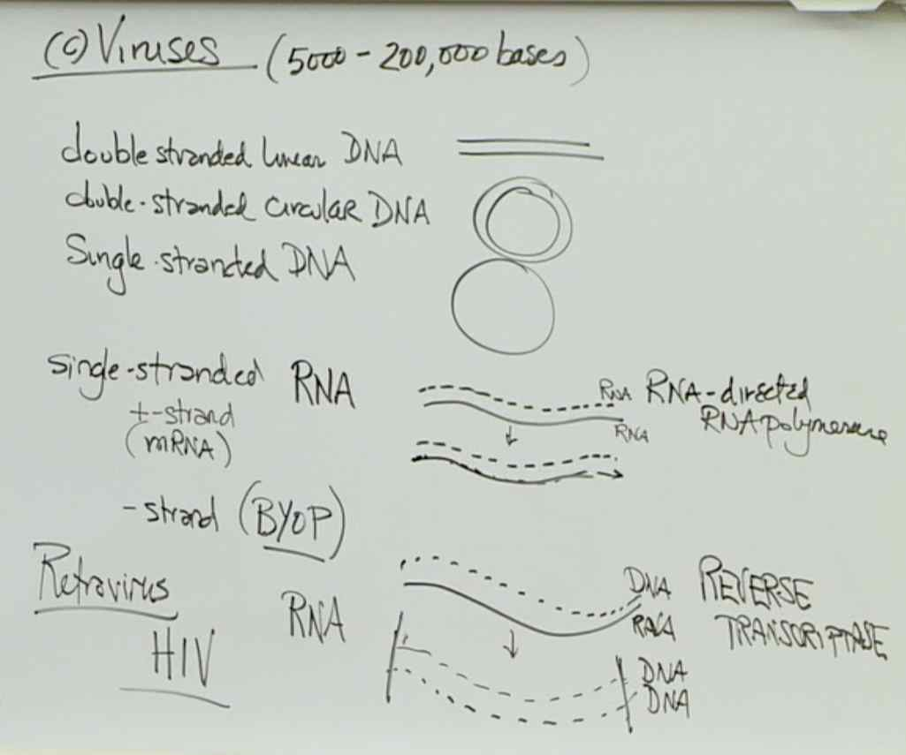
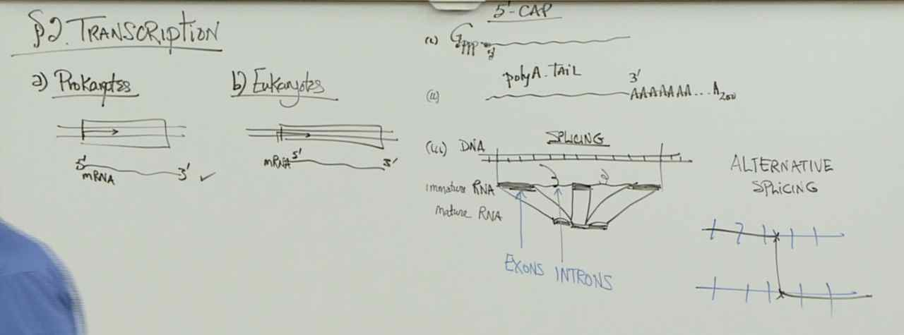
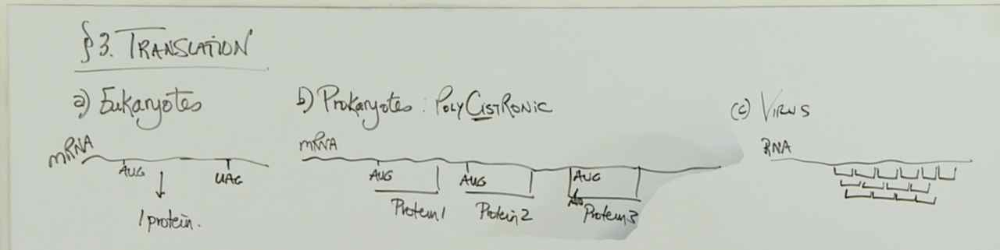

# Lecture 13 -- Variations on the **theme**

> 

> 
> When linear chromosomes are replicated, the very 3’ end of the strand that is copied in a discontinuous manner (the template for the lagging strand) is not copied. Over many generations, this can cause a shortening of the chromosomes. The enzyme telomerase can mitigate this problem.

> 

> 
> Alternative splicing. Many eukaryotic genes have intervening sequences called introns that are initially transcribed, but are then removed in a process called splicing. The original transcript can be spliced in alternative ways to give different mature mRNAs, and each different mRNA would encode a different protein.

> 
> Splicing and alternative splicing does not occur in prokaryotic cells. As discussed in lecture, viral transcripts can be translated using multiple reading frames. In addition, some prokaryotic genes are organized in operons. An operon encodes a polycistronic mRNA which means that a single promoter can drive the transcription of an mRNA that encodes several related proteins.
